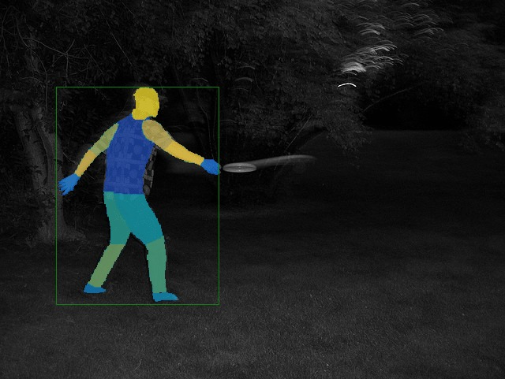
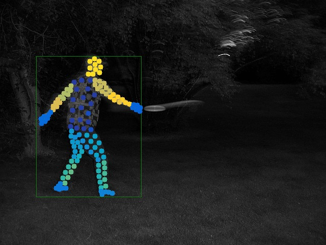
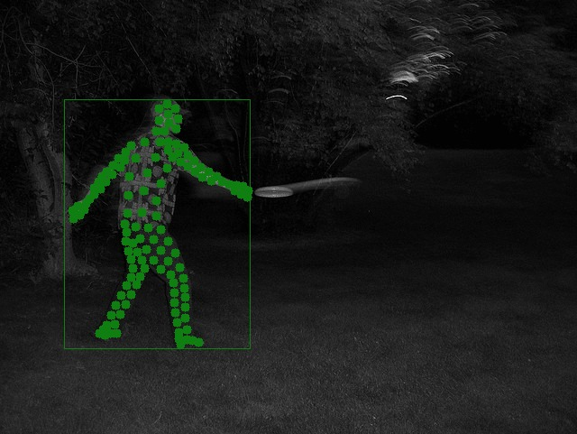
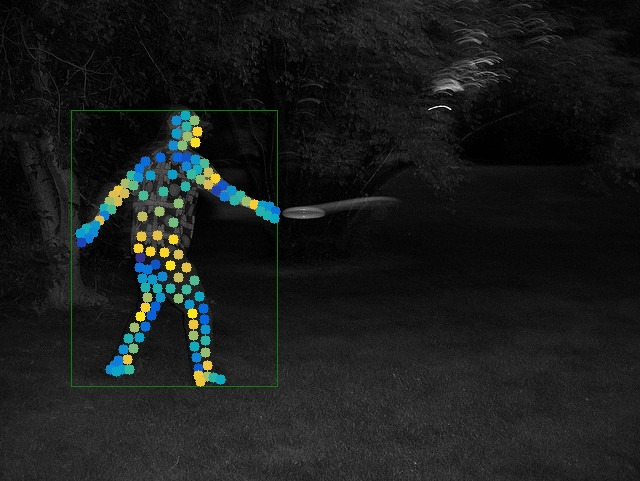
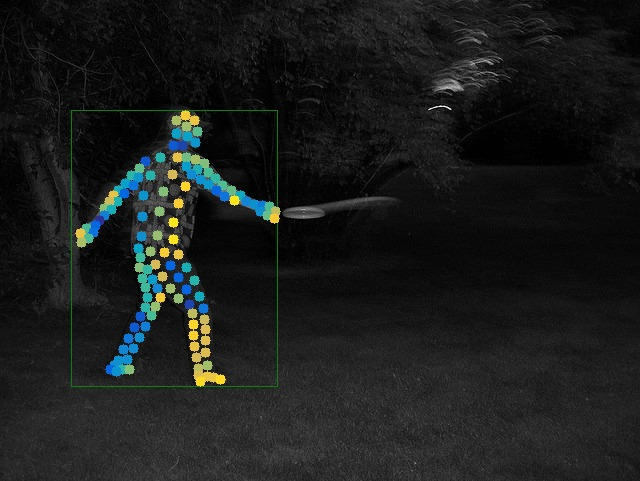

# Query Dataset

`query_db` is a tool to print or visualize DensePose data from a dataset.
It has two modes: `print` and `show` to output dataset entries to standard
output or to visualize them on images.

## Print Mode

The general command form is:
```bash
python query_db.py print [-h] [-v] [--max-entries N] <dataset> <selector>
```

There are two mandatory arguments:
 - `<dataset>`, DensePose dataset specification, from which to select
   the entries (e.g. `densepose_coco_2014_train`).
 - `<selector>`, dataset entry selector which can be a single specification,
   or a comma-separated list of specifications of the form
   `field[:type]=value` for exact match with the value
   or `field[:type]=min-max` for a range of values

One can additionally limit the maximum number of entries to output
by providing `--max-entries` argument.

Examples:

1. Output at most 10 first entries from the `densepose_coco_2014_train` dataset:
```bash
python query_db.py print densepose_coco_2014_train \* --max-entries 10 -v
```

2. Output all entries with `file_name` equal to `COCO_train2014_000000000036.jpg`: 
```bash
python query_db.py print densepose_coco_2014_train file_name=COCO_train2014_000000000036.jpg -v
```

3. Output all entries with `image_id` between 36 and 156:
```bash
python query_db.py print densepose_coco_2014_train image_id:int=36-156 -v
```

## Visualization Mode

The general command form is:
```bash
python query_db.py show [-h] [-v] [--max-entries N] [--output1 <image_file>] <dataset> <selector> <visualizations>
```

There are three mandatory arguments:
 - `<dataset>`, DensePose dataset specification, from which to select
   the entries (e.g. `densepose_coco_2014_train`).
 - `<selector>`, dataset entry selector which can be a single specification,
   or a comma-separated list of specifications of the form
   `field[:type]=value` for exact match with the value
   or `field[:type]=min-max` for a range of values
 - `<visualizations>`, visualizations specifier; currently available visualizations are:
   * `bbox` - bounding boxes of annotated persons;
   * `dp_i` - annotated points colored according to the containing part;
   * `dp_pts` - annotated points in green color;
   * `dp_segm` - segmentation masks for annotated persons;
   * `dp_u` - annotated points colored according to their U coordinate in part parameterization;
   * `dp_v` - annotated points colored according to their V coordinate in part parameterization;

One can additionally provide one of the two optional arguments:
 - `--max_entries` to limit the maximum number of entries to visualize
 - `--output` to provide visualization file name template, which defaults
   to `output.png`. To distinguish file names for different dataset
   entries, the tool appends 1-based entry index to the output file name,
   e.g. output.0001.png, output.0002.png, etc.

The following examples show how to output different visualizations for image with `id = 322`
from `densepose_coco_2014_train` dataset:

1. Show bounding box and segmentation:
```bash
python query_db.py show densepose_coco_2014_train image_id:int=322 bbox,dp_segm -v
```


2. Show bounding box and points colored according to the containing part:
```bash
python query_db.py show densepose_coco_2014_train image_id:int=322 bbox,dp_i -v
```


3. Show bounding box and annotated points in green color:
```bash
python query_db.py show densepose_coco_2014_train image_id:int=322 bbox,dp_segm -v
```


4. Show bounding box and annotated points colored according to their U coordinate in part parameterization:
```bash
python query_db.py show densepose_coco_2014_train image_id:int=322 bbox,dp_u -v
```


5. Show bounding box and annotated points colored according to their V coordinate in part parameterization:
```bash
python query_db.py show densepose_coco_2014_train image_id:int=322 bbox,dp_v -v
```



